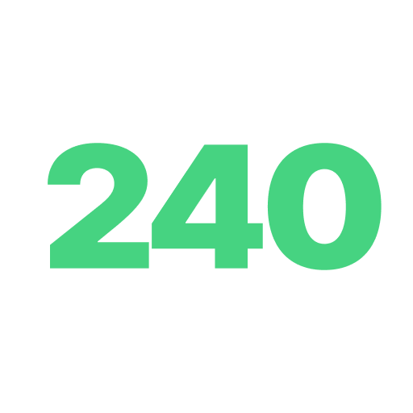

<!--  -->

# ICPC Sinchon Official Website

> 신촌지역 대학교 프로그래밍 동아리 연합 공식 홈페이지

## 설치 및 개발환경 준비

아래의 명령어를 통해 레파지토리를 클론합니다.

```shell
git clone https://github.com/icpc-sinchon/icpc-sinchon.github.io
```

아래의 명령어를 통해 패키지 의존성을 설치합니다.

```shell
yarn
```

의존성을 설치한 후, 아래의 명령어를 통해 Next.js를 개발환경에서 실행할 수 있습니다.

```shell
yarn dev
```

기본 포트는 `4789`로, `localhost:4789`에서 페이지를 확인해볼 수 있습니다.

## 배포하기

### main 브랜치로 pull request

기여자분의 `fork`한 레파지토리에서, 혹은 `branch`에서 `main` 브랜치로 `pull request`를 보내주세요.
`merge`가 완료되면 `github actions`를 통해 배포됩니다.

## 추가

페이지 내 이미지들은 전부 `https://api.suapc.kr`로 링크되어 있습니다.
github pages의 느린 이미지 로딩 속도를 극복하기 위해 해놓은 조치이니, 기여에 참고 부탁드립니다.

이미지를 추가하실 경우, `public/res`폴더 내에 넣고 일반적인 방법대로 링크를 해주시면 제가
`api` 서버로 옮겨서 수정하겠습니다.
